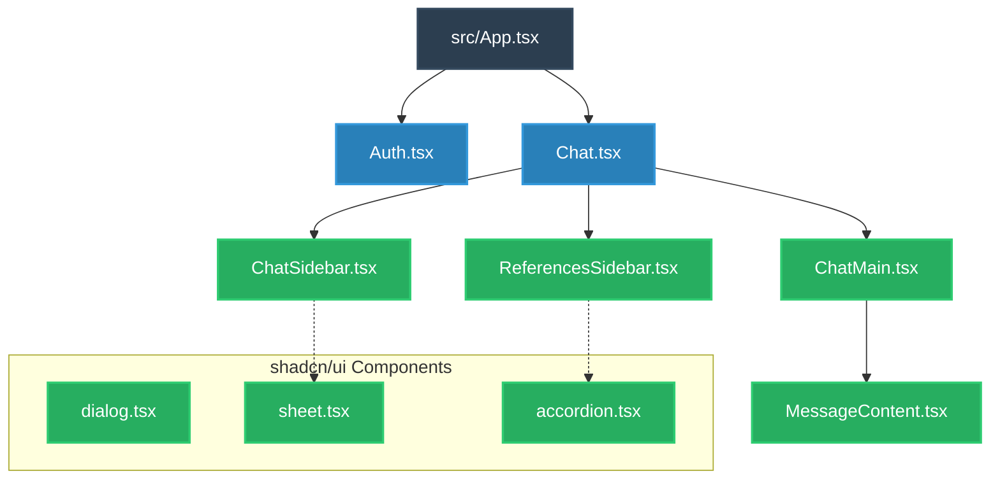
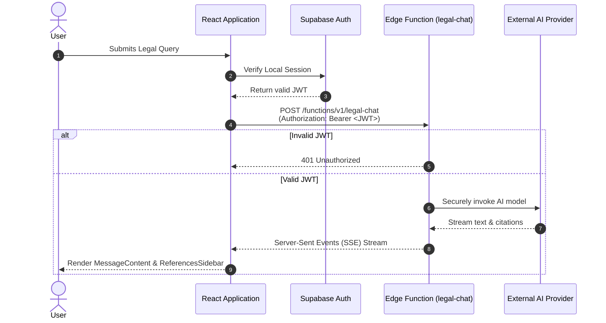

# ⚖️ Your AI Counsel

### The Open-Source, Citation-Backed Legal AI Workspace

---

## 🎯 Overview

**Your AI Counsel** is a full-stack legal technology application built for precision, security, and context. General-purpose LLMs hallucinate; this application is designed to ground AI responses in verifiable facts.

By leveraging a modular React frontend (`ChatMain.tsx`, `ChatSidebar.tsx`) and a dedicated citations panel (`ReferencesSidebar.tsx`), users can interact with AI while simultaneously reviewing the exact legal sources and context backing the generated advice. All AI inference is heavily guarded behind Supabase Edge Functions with strict JWT validation (`verify_jwt = true`), ensuring zero client-side credential exposure.

---

## 🚀 Key Features

* **Verifiable AI Citations:** The UI features a purpose-built `ReferencesSidebar.tsx` that visually maps AI claims to specific source documents.


* **Zero-Trust Edge Computing:** The LLM is never accessed directly from the browser. Requests are routed through the `legal-chat` Supabase Edge Function.


* **Enterprise-Grade UI Components:** The interface is constructed using a comprehensive suite of accessible Radix primitives (via `shadcn/ui`), styled with Tailwind CSS (`tailwind.config.ts`).


* **Automated CI/CD:** A configured GitHub Actions workflow (`.github/workflows/static.yml`) ensures seamless integration and static deployment.


* **Typesafe BaaS Integration:** Deeply integrated with Supabase, utilizing generated TypeScript definitions (`src/integrations/supabase/types.ts`) for end-to-end type safety.


---

## 🏗️ Architecture & Component Flow

### 1. The Frontend Component Tree

The UI is strictly modular, separating the authentication layer from the chat workspace and the chat workspace from the individual message rendering.



### 2. The Secure Authorization & Inference Loop

To prevent abuse, the application enforces a strict JWT-bearer authorization flow before the AI is ever invoked.



---

## 🛠️ Tech Stack

| Category | Technologies Used |
| --- | --- |
| **Frontend Framework** | React 18, Vite (`vite.config.ts`)|
| **Language** | TypeScript (`tsconfig.json`)|
| **Styling & UI** | Tailwind CSS, `shadcn/ui` components (`src/components/ui/`)|
| **Backend & Auth** | Supabase Auth, PostgreSQL|
| **Serverless Functions** | Supabase Edge Functions (Deno) (`supabase/functions/`)|
| **Package Manager** | Bun (`bun.lockb`)|

---

## ⚙️ Local Development Guide

Get the complete stack running on your local machine in under 5 minutes.

### Prerequisites

* [Node.js](https://nodejs.org/) (v18+)
* [Bun](https://bun.sh/) package manager


* [Supabase CLI](https://supabase.com/docs/guides/cli)
* Docker Desktop (required by Supabase CLI for local databases)

### 1. Clone & Install

```bash
git clone https://github.com/yourusername/your-ai-counsel.git
cd your-ai-counsel
bun install

```

### 2. Environment Variables

Create a `.env` file in the root of the project to connect the frontend to the backend.

```env
VITE_SUPABASE_URL=http://127.0.0.1:54321
VITE_SUPABASE_ANON_KEY=your_local_anon_key

```

### 3. Start the Backend Infrastructure

Use the Supabase CLI to spin up the local PostgreSQL database, Auth service, and Edge Functions.

```bash
supabase start

```

### 4. Start the Frontend Application

Boot the Vite development server.

```bash
bun run dev

```

Navigate to `http://localhost:5173` to interact with the application.
